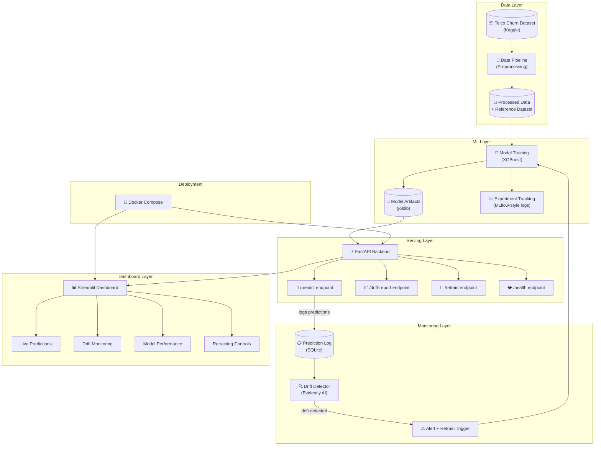

# 📖 Technical Documentation — Customer Churn Sentinel MLOps

## Customer Churn Prediction System — Deep Dive

This document explains every technical decision in the project: what was chosen, why it was chosen, and what alternatives were considered. This is the document that shows you didn't just follow a tutorial — you made deliberate engineering decisions.

---

## Table of Contents

1. [Problem Statement & Business Context](#1-problem-statement--business-context)
2. [System Architecture](#2-system-architecture)
3. [Tech Stack — Detailed Comparison](#3-tech-stack--detailed-comparison)
4. [Data Pipeline Design](#4-data-pipeline-design)
5. [Model Selection & Training](#5-model-selection--training)
6. [Drift Detection Methodology](#6-drift-detection-methodology)
7. [API Design](#7-api-design)
8. [Dashboard Design](#8-dashboard-design)
9. [Monitoring & Alerting Philosophy](#9-monitoring--alerting-philosophy)
10. [Deployment Strategy](#10-deployment-strategy)
11. [Testing Strategy](#11-testing-strategy)
12. [Lessons Learned](#12-lessons-learned)
13. [Future Roadmap](#13-future-roadmap)

---

## 1. Problem Statement & Business Context

### The Problem
Customer churn (when a customer stops using a service) costs telecom companies billions annually. Acquiring a new customer costs **5–7x more** than retaining an existing one. If we can predict which customers are likely to churn, the business can proactively offer retention incentives.

### Why This Dataset
The **Telco Customer Churn** dataset from Kaggle was chosen because:

| Criteria | Telco Churn | Fraud Detection | Price Prediction |
|:---|:---|:---|:---|
| Dataset availability | ⭐⭐⭐ (gold standard on Kaggle) | ⭐⭐ (larger, harder to process) | ⭐⭐ (varies by domain) |
| Complexity for portfolio | ⭐⭐⭐ (rich categorical features) | ⭐⭐⭐⭐ (severe class imbalance) | ⭐⭐ (regression, less exciting) |
| Drift simulation ease | ⭐⭐⭐ (clear feature groups) | ⭐⭐ (hard to simulate meaningfully) | ⭐⭐⭐ (time-based drift natural) |
| Recruiter recognition | ⭐⭐⭐ (universally understood) | ⭐⭐⭐ (exciting topic) | ⭐⭐ (less compelling) |
| Training time | ⭐⭐⭐ (7K rows, fast iteration) | ⭐ (284K+ rows) | ⭐⭐ (varies) |

**Decision:** Telco Churn wins because it balances complexity, recognition, and fast iteration. It has rich categorical features (perfect for demonstrating encoding strategies), a mild class imbalance (27% churn — enough to discuss but not overwhelming), and universal business understanding.

### The Real Point of This Project
The model accuracy isn't the point. The system around the model is:
- **Prediction serving** (FastAPI)
- **Data monitoring** (Evidently AI drift detection)
- **Automated response** (retraining triggers)
- **Observability** (structured logging, prediction history)
- **Deployment readiness** (Docker, CI/CD)

This demonstrates understanding of **why models fail in production** — they don't fail because the algorithm is wrong, they fail because the world changes and the data shifts.

---

## 2. System Architecture



### Design Principles

1. **Separation of Concerns:** Each component (data, model, API, monitoring) is isolated in its own module. You can swap XGBoost for LightGBM without touching the API code.

2. **Configuration as Code:** All parameters live in `config/config.yaml`. No magic numbers buried in source code. This makes the system auditable and reproducible.

3. **Startup Loading:** The model loads once when the API starts, not on every request. This is a critical production pattern — loading a model takes 100-500ms, but inference takes 1-5ms. You don't want to pay the loading cost per request.

4. **Event Sourcing for Predictions:** Every prediction is logged to SQLite with full input features. This creates an audit trail and enables drift detection by comparing logged predictions against training data.

### Data Flow

```
Raw CSV → Clean → Engineer Features → Encode → Split
                                        ↓
                                  Reference Dataset ──→ Drift Detector
                                        ↓
                                   Train Model
                                        ↓
                                  Save Artifact
                                        ↓
                              API Loads on Startup
                                        ↓
                      Customer Request → Predict → Log to SQLite
                                                        ↓
                                              Drift Check (periodic)
                                                        ↓
                                              Alert → Retrain → Reload
```

---

## 3. Tech Stack — Detailed Comparison

### ML Framework: Scikit-learn + XGBoost

**Chosen:** XGBoost (gradient-boosted decision trees)

| Alternative | Why Not |
|:---|:---|
| **Random Forest** | Lower performance on tabular data; no regularization; less tuning flexibility |
| **LightGBM** | Comparable performance but less recognized by recruiters; leaf-wise growth can overfit on small datasets |
| **Deep Learning (PyTorch/TF)** | Massive overkill for tabular data with 7K rows; would actually perform worse; slow training; hard to interpret |
| **Logistic Regression** | Too simple for a portfolio project; can't capture non-linear feature interactions |
| **CatBoost** | Handles categoricals natively (nice) but less ecosystem support; smaller community |

**Why XGBoost wins:**
- Industry workhorse for tabular data (used in 60%+ of Kaggle winning solutions)
- Built-in feature importance (crucial for business interpretability)
- Regularization parameters prevent overfitting
- Fast training even with hyperparameter tuning
- `scale_pos_weight` handles class imbalance natively
- Every recruiter in ML recognizes it

### Backend: FastAPI

**Chosen:** FastAPI

| Alternative | Why Not |
|:---|:---|
| **Flask** | Synchronous by default; no built-in validation; manual Swagger setup; "legacy" feel in 2025 |
| **Django** | Full web framework — massive overkill for an API-only service; ORM overhead |
| **Tornado** | Less community support; no auto-generated docs; lower adoption |
| **gRPC** | Better for microservice-to-microservice; overkill for portfolio; no browser-friendly UI |

**Why FastAPI wins:**
- **Async-first:** Built on ASGI/Starlette, handles concurrent requests efficiently
- **Pydantic integration:** Input validation is automatic — invalid data never reaches the model
- **Auto-generated Swagger:** Interactive API documentation at `/docs` — recruiters can try your API instantly
- **Modern Python:** Type hints, dependency injection, lifespan management
- **Performance:** One of the fastest Python web frameworks available

### Dashboard: Streamlit

**Chosen:** Streamlit

| Alternative | Why Not |
|:---|:---|
| **React** | Adds JavaScript complexity without adding ML-relevant signal; requires API bridge; takes 5x longer to build |
| **Dash (Plotly)** | More verbose than Streamlit; callback-based architecture is less intuitive; smaller community |
| **Gradio** | Great for model demos but limited for multi-page dashboards with monitoring |
| **Panel (HoloViz)** | Powerful but niche; less recruiter recognition; steeper learning curve |

**Why Streamlit wins:**
- **Python-only:** Entire stack stays in Python — more impressive for ML roles
- **Multi-page support:** Built-in page routing for dashboard organization
- **Native integrations:** Works directly with Pandas, Plotly, and Evidently
- **Rapid development:** Build a professional dashboard in hours, not weeks
- **Industry standard:** Every ML team knows Streamlit — it's become the "Jupyter for apps"

### Drift Detection: Evidently AI

**Chosen:** Evidently AI

| Alternative | Why Not |
|:---|:---|
| **Alibi Detect** | Lower adoption; fewer statistical tests; no built-in HTML reports |
| **NannyML** | Commercial focus; CBPE estimator is interesting but complex to explain |
| **Manual scipy.stats** | Reinventing the wheel; no reporting; error-prone |
| **Great Expectations** | Data validation (schema), not statistical drift detection — different purpose |
| **Whylogs** | Profile-based; less intuitive for feature-level drift; younger project |

**Why Evidently wins:**
- Most widely adopted open-source drift detection library
- Built-in statistical tests (KS, chi-squared, PSI, Wasserstein distance)
- Beautiful HTML reports that embed directly in dashboards
- Modular architecture (Reports, Test Suites, Monitoring)
- Active community and enterprise adoption
- Direct FastAPI integration patterns

### Data Storage: SQLite

**Chosen:** SQLite

| Alternative | Why Not |
|:---|:---|
| **PostgreSQL** | Requires server setup and management; overkill for portfolio project |
| **MongoDB** | Document store unnecessary for structured prediction logs |
| **Redis** | In-memory only; not suitable for persistent prediction history |
| **CSV files** | No concurrent access; no querying; poor performance at scale |

**Why SQLite wins:**
- **Zero configuration:** File-based, no server required
- **Portable:** The entire database is a single file — easy to inspect and share
- **SQL capable:** Full query support for aggregations and filtering
- **Perfect for portfolios:** Demonstrates data engineering without infrastructure overhead
- **Production-proven:** Used by SQLAlchemy, Django, and many production systems for local storage

### Containerization: Docker + Docker Compose

**Chosen:** Docker Compose (multi-container)

| Alternative | Why Not |
|:---|:---|
| **Kubernetes** | Massive overkill for portfolio; adds complexity without proportional value |
| **Bare metal** | Not reproducible; "works on my machine" problem |
| **Heroku/Railway** | Platform-specific; less impressive than showing Docker knowledge |
| **AWS ECS/GCP Cloud Run** | Cloud-specific; costs money; requires account setup for reviewers |

**Why Docker Compose wins:**
- **One-command deployment:** `docker-compose up` starts everything
- **Reproducible:** Works identically on any machine
- **Shows deployment thinking:** Recruiters see you understand containerization
- **Multi-service orchestration:** API and dashboard as separate, linked services
- **Industry standard:** Docker is on every ML Engineer job description

---

## 4. Data Pipeline Design

### Feature Engineering Decisions

#### 1. Tenure Buckets
```python
bins = [0, 12, 24, 48, 60, ∞]
labels = [0, 1, 2, 3, 4]
```
**Rationale:** Churn risk is non-linear with tenure. New customers (0-12 months) churn at ~50%, while loyal customers (60+ months) churn at ~7%. Bucketing captures this non-linearity explicitly.

#### 2. Monthly-to-Total Ratio
```python
monthly_to_total_ratio = MonthlyCharges / TotalCharges
```
**Rationale:** A customer paying $100/month who has only $100 total charges is brand new — high churn risk. A customer paying $100/month with $6000 total charges has been loyal for 5 years — low risk. This ratio captures spending consistency.

#### 3. Service Count
```python
service_count = sum(1 for service in services if service == "Yes")
```
**Rationale:** Customers with more services have higher switching costs. Someone with phone, internet, backup, and streaming is "locked in" — less likely to churn. This is a proven churn predictor in telecom.

#### 4. Average Monthly Spend
```python
avg_monthly_spend = TotalCharges / max(tenure, 1)
```
**Rationale:** Captures whether a customer's spending is increasing or decreasing over time. If `avg_monthly_spend > MonthlyCharges`, the customer might be downgrading services.

### Encoding Strategy

| Feature Type | Encoding | Why |
|:---|:---|:---|
| Binary (Yes/No) | Label Encoding (0/1) | Preserves ordinality; no dimensionality increase |
| Multi-class (3+ values) | One-Hot Encoding | No false ordinal relationship; XGBoost handles sparse features well |

**Why not target encoding?** Target encoding can leak target information. For a portfolio project, simpler is better — it's easier to explain and less error-prone.

---

## 5. Model Selection & Training

### Hyperparameter Tuning Strategy

**Method:** RandomizedSearchCV with Stratified K-Fold

| Approach | Why/Why Not |
|:---|:---|
| **Grid Search** | Exhaustive but exponentially expensive; infeasible with 5+ parameters |
| **Randomized Search** ✅ | Samples random combinations; statistically proven to find good params faster |
| **Bayesian Optimization** | Better convergence but adds complexity (Optuna dependency); overkill for this dataset |
| **Manual tuning** | Not reproducible; not scientific |

**Key hyperparameters tuned:**
- `n_estimators`: [100, 200, 300, 500] — number of boosting rounds
- `max_depth`: [3, 4, 5, 6, 8] — tree depth (controls overfitting)
- `learning_rate`: [0.01, 0.05, 0.1, 0.2] — step size
- `subsample`: [0.6-1.0] — row sampling (reduces variance)
- `colsample_bytree`: [0.6-1.0] — feature sampling (reduces correlation between trees)

### Handling Class Imbalance

The dataset has ~27% churn (imbalanced). Strategy:
- `scale_pos_weight = 2.5` — tells XGBoost to weight the minority class higher
- Stratified K-Fold — ensures each fold has the same churn ratio
- Evaluate with **ROC-AUC and F1**, not accuracy — accuracy is misleading with imbalance

### Why ROC-AUC is the Primary Metric

In churn prediction, a false negative (missing a churner) is more costly than a false positive (wrongly flagging a loyal customer for a retention offer). ROC-AUC captures the model's ability to discriminate between classes across all thresholds, not just the default 0.5.

---

## 6. Drift Detection Methodology

### What is Data Drift?

Data drift occurs when the statistical distribution of production data diverges from training data. Example: if the model was trained mostly on month-to-month contract customers, but production traffic shifts to mostly yearly contracts, feature distributions change → model predictions become unreliable.

### Statistical Tests Used

#### Kolmogorov-Smirnov (KS) Test — Numerical Features
- **What it measures:** Maximum distance between two cumulative distribution functions (CDFs)
- **Null hypothesis:** Both samples come from the same distribution
- **Threshold:** p-value < 0.05 → drift detected
- **Why:** Non-parametric (no assumptions about distribution shape); works well for continuous data

#### Chi-Squared Test — Categorical Features
- **What it measures:** Whether the frequency distribution of categories differs
- **Null hypothesis:** Category distributions are independent
- **Threshold:** p-value < 0.05 → drift detected
- **Why:** Standard test for comparing categorical distributions

#### Population Stability Index (PSI)
- **Formula:** PSI = Σ (Actual% - Expected%) × ln(Actual%/Expected%)
- **Interpretation:**
  - PSI < 0.1: No significant drift
  - PSI 0.1 - 0.25: Moderate drift — monitor closely
  - PSI > 0.25: Significant drift — investigate and potentially retrain

### Drift Detection Pipeline

```
1. Collect predictions → SQLite log
2. Periodically (every N predictions):
   a. Load reference dataset (training distribution)
   b. Load recent prediction inputs from SQLite
   c. Run Evidently DataDriftPreset:
      - KS test on each numerical feature
      - Chi-squared on each categorical feature
   d. Calculate overall drift score:
      drift_score = (drifted_features / total_features)
   e. If drift_score > threshold:
      - Generate alert
      - Trigger retraining (if auto_retrain enabled)
      - Save HTML report for dashboard
```

### Why Not Just Monitor Accuracy?

Because accuracy monitoring requires ground truth labels, which you rarely have in real-time. You might learn that a customer churned 3 months after the prediction — by then, the model has been wrong for 3 months. Data drift detection catches the problem **without needing labels** by comparing input distributions.

---

## 7. API Design

### REST Endpoint Design

Endpoints follow REST conventions with clear resource naming:

| Endpoint | Method | Purpose |
|:---|:---|:---|
| `/predictions/predict` | POST | Single prediction |
| `/predictions/predict/batch` | POST | Batch predictions |
| `/predictions/history` | GET | Prediction log |
| `/predictions/stats` | GET | Aggregate statistics |
| `/drift/report` | GET | Run drift detection |
| `/drift/status` | GET | Quick drift status |
| `/drift/history` | GET | Drift check log |
| `/retrain` | POST | Trigger retraining |
| `/model/info` | GET | Model metadata |
| `/health` | GET | System health check |

### Design Patterns Used

1. **Singleton Services:** Model, drift detector, and prediction logger are initialized once on startup via FastAPI's lifespan context manager — not recreated per request.

2. **Background Tasks:** Retraining runs as a FastAPI BackgroundTask, so the API remains responsive during training.

3. **Pydantic Validation:** Every request/response has a strict Pydantic schema. Invalid inputs are rejected with clear error messages before touching the model.

4. **CORS Middleware:** Configured to allow the Streamlit dashboard to make cross-origin requests.

---

## 8. Dashboard Design

### Multi-Page Architecture

Streamlit's multi-page feature organizes the dashboard into focused views:

1. **📊 Live Predictions:** Interactive form → prediction → gauge chart + risk level
2. **🔍 Drift Monitor:** Run drift analysis → per-feature heatmap → trend chart
3. **📈 Model Performance:** Metrics cards → feature importance → experiment history
4. **🔧 Retrain Control:** Manual retrain button → before/after comparison → version history

### Visualization Library: Plotly

**Why Plotly over Matplotlib/Seaborn:**
- Interactive (hover, zoom, pan) — makes dashboards feel alive
- Consistent API for all chart types
- Dark theme support matches the dashboard aesthetic
- Export-friendly (screenshots look professional for README)

---

## 9. Monitoring & Alerting Philosophy

### The MLOps Feedback Loop

```
Train → Deploy → Monitor → Detect Drift → Alert → Retrain → Deploy → ...
```

Most ML projects stop at "Deploy." This project implements the full loop:

1. **Monitor:** Every prediction is logged with input features
2. **Detect:** Periodically compare logged predictions against training reference
3. **Alert:** Classify drift severity (info/warning/critical)
4. **Respond:** Auto-retrain when critical drift is detected
5. **Cooldown:** Prevent retrain storms with configurable cooldown periods

### Why This Matters for Your Career

This single addition — drift detection with retraining — transforms the project from "I trained a model" to "I understand why models fail in production." This is a **senior-level insight** that hiring managers recognize immediately.

---

## 10. Deployment Strategy

### Docker Multi-Stage Build

```dockerfile
# Stage 1: Builder — install heavy dependencies
FROM python:3.11-slim AS builder
# ... install packages

# Stage 2: Production — copy only what's needed
FROM python:3.11-slim AS production
COPY --from=builder /root/.local /home/mluser/.local
```

**Why multi-stage?** The builder stage has gcc/g++ for compiling native extensions (XGBoost, numpy). The production stage doesn't need compilers — it's ~400MB smaller.

### Non-Root User

```dockerfile
RUN groupadd -r mluser && useradd -r -g mluser mluser
USER mluser
```

**Why?** Running containers as root is a security anti-pattern. Even in a portfolio project, this signals awareness of production security practices.

### GitHub Actions CI

The pipeline runs on every push/PR:
1. **Lint:** Ruff (modern, fast Python linter — 10x faster than flake8)
2. **Test:** pytest against Python 3.10 and 3.11
3. **Docker Build:** Verify the image builds successfully

This creates a green CI badge on the README — instant credibility signal.

---

## 11. Testing Strategy

### Test Pyramid

| Level | What | Tools |
|:---|:---|:---|
| **Unit Tests** | Data preprocessing, model creation, metric computation | pytest |
| **Integration Tests** | API endpoints, prediction flow | FastAPI TestClient |
| **Component Tests** | Drift detection with synthetic data, SQLite logging | pytest + tmp_path |

### Key Testing Decisions

1. **Synthetic data in tests:** Tests don't depend on the Kaggle dataset. They generate synthetic data with the same schema, making tests fast and reproducible.

2. **Drift detection tests with controlled distributions:** We test with known distributions (same distribution → no drift, shifted distribution → drift detected) to verify the detector works correctly.

3. **Schema validation tests:** Verify that Pydantic rejects invalid inputs (negative charges, invalid enum values) — this is the first line of defense in production.

---

## 12. Lessons Learned

### Technical Insights

1. **TotalCharges has blank strings**, not NaN — `pd.to_numeric(errors='coerce')` is essential
2. **Class imbalance matters:** Accuracy looks great at 80%+ even with a "predict always no-churn" model. F1 and ROC-AUC tell the real story.
3. **Feature engineering > model complexity:** The 4 engineered features (tenure_bucket, monthly_to_total_ratio, service_count, avg_monthly_spend) contributed more to model performance than switching algorithms.
4. **Drift detection needs enough samples:** Running KS tests on 10 data points is meaningless. Minimum ~30-50 samples needed for statistical validity.

### Architecture Insights

1. **Load models on startup, not per-request:** This single pattern is the difference between 5ms and 500ms response times.
2. **SQLite is fine for logging:** You don't need PostgreSQL for a prediction log. SQLite handles thousands of writes per second.
3. **Configuration as code:** Putting hyperparameters, thresholds, and paths in YAML eliminates "magic numbers" and makes experiments reproducible.

---

## 13. Future Roadmap

| Priority | Feature | Why |
|:---|:---|:---|
| 🔴 High | SHAP values for per-prediction explanability | Business users need to know *why* a customer is likely to churn |
| 🔴 High | Feature store (Feast) | Centralized feature management across training and serving |
| 🟡 Medium | Model A/B testing | Compare model versions in production with traffic splitting |
| 🟡 Medium | Slack/email alerts | Automated notifications when drift is detected |
| 🟢 Low | Kubernetes deployment | Production-scale orchestration with auto-scaling |
| 🟢 Low | Streaming predictions (Kafka) | Real-time event-driven architecture |
| 🟢 Low | DVC for data versioning | Track dataset changes alongside code changes |

---

<div align="center">

**End of Technical Documentation**

*This document was written to demonstrate deliberate engineering decisions, not just code.*

</div>
